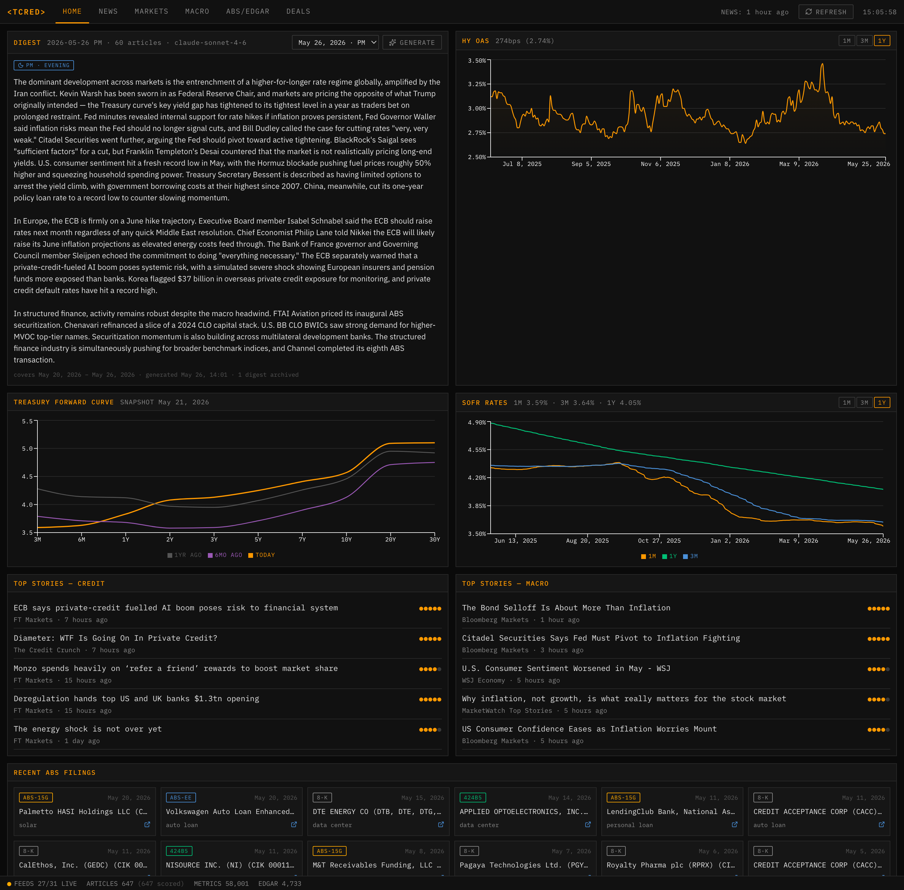
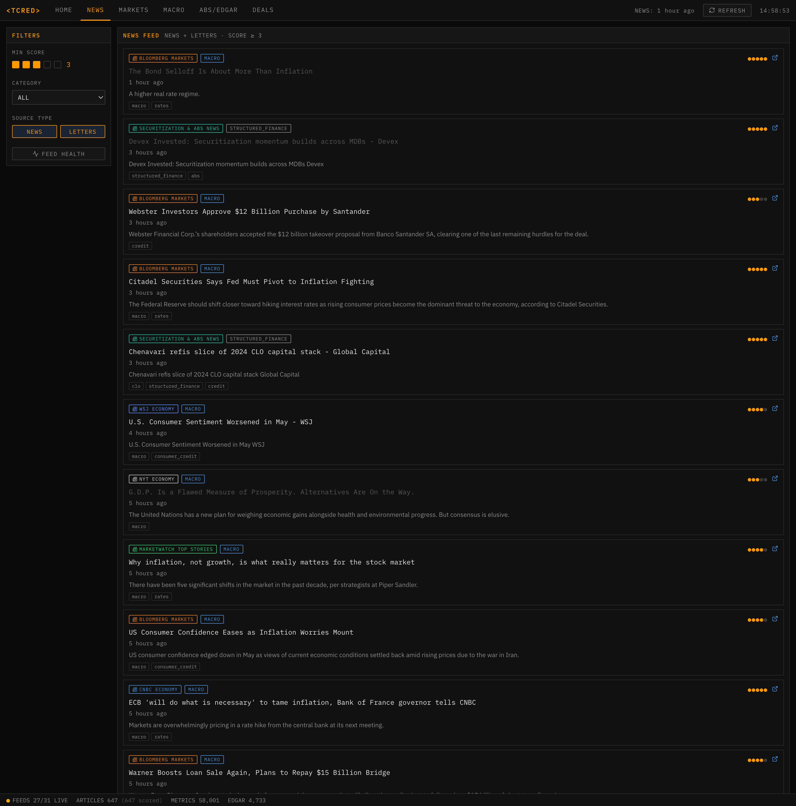
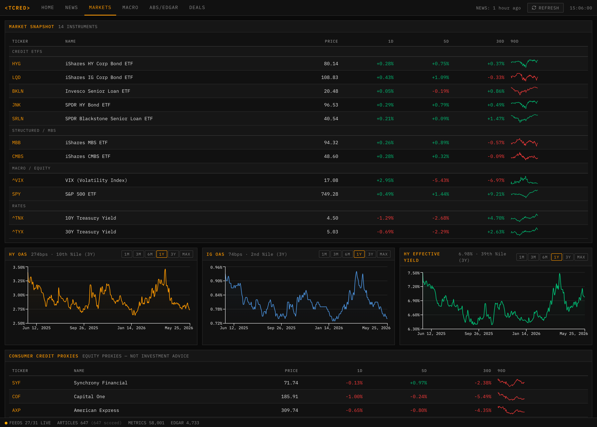
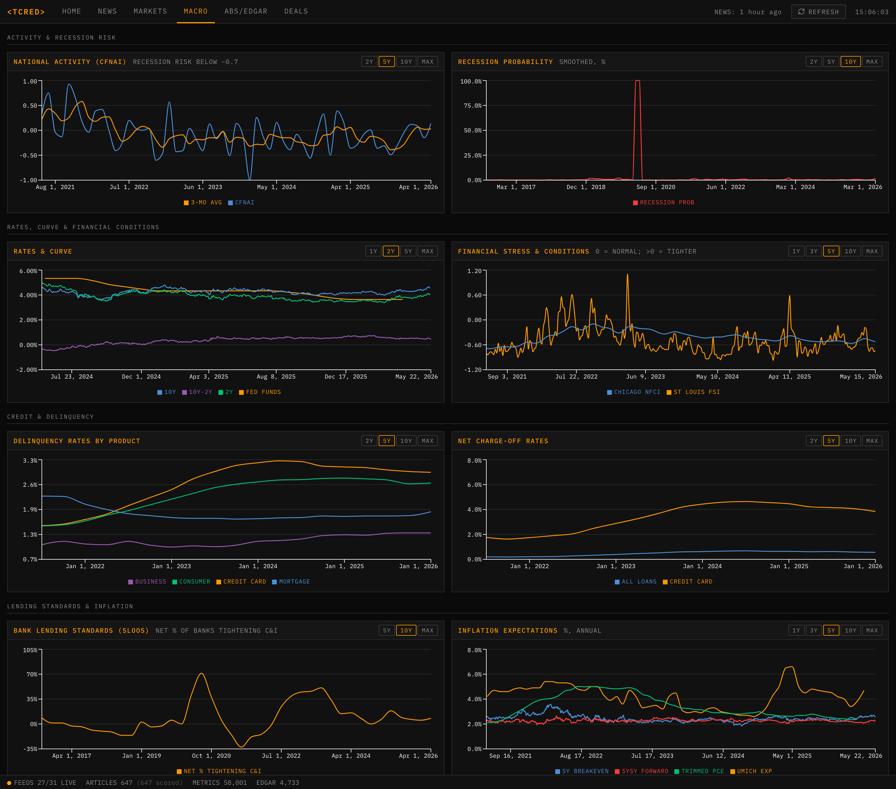
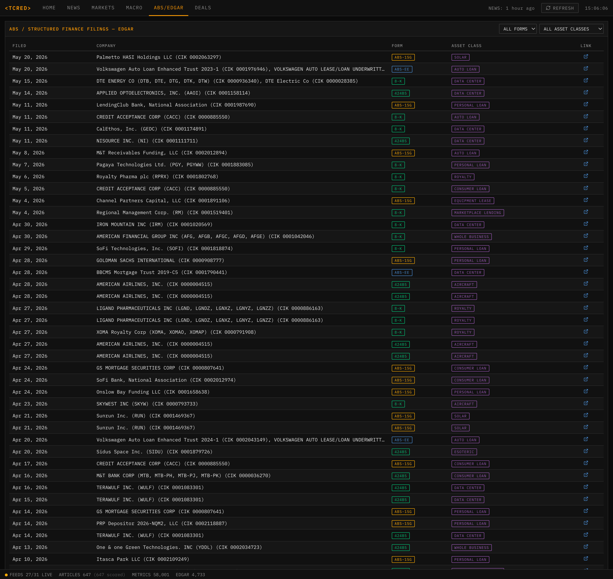
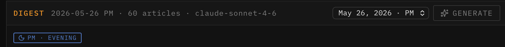
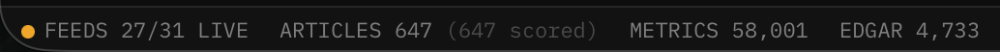

# `<TCRED>`

> A self-hosted, Bloomberg-terminal–styled intelligence dashboard for **macro, credit, and
> structured finance**. One local server, reachable from any device on your home network.
> The name is a wink at Bloomberg's `<BCRED>` function.



---

## Quickstart

```bash
# 1. Keys (see Requirements below)
cp .env.example .env && $EDITOR .env       # add FRED + Anthropic keys + EDGAR user-agent

# 2. Backend
cd backend && python3 -m venv .venv && source .venv/bin/activate
pip install -r requirements.txt

# 3. Frontend (build the static app the backend serves)
cd ../frontend && npm install && npm run build

# 4. Run (serves API + app on http://localhost:8000)
cd ../backend && python main.py
```

Then open **http://localhost:8000** on this Mac, or **http://&lt;your-lan-ip&gt;:8000** from
an iPad on the same Wi-Fi (`ipconfig getifaddr en0` to find the IP). For an always-on
service, see [Running as a service](#running-as-a-service).

> **You provide three credentials** (all free): an **Anthropic API key**, a **FRED API key**,
> and an **EDGAR User-Agent** string. The app runs without them, but news scoring, the AI
> digest, and macro data stay empty until they're set. See [Requirements](#requirements).

---

## Requirements

| Tool | Version | Notes |
|---|---|---|
| Python | 3.11+ | built & run on 3.14 |
| Node.js | 18+ | built on 26; only needed to build the frontend |
| OS | macOS | uses `launchd` for the auto-start service |

### Credentials (`.env`)

| Variable | What it is | Where to get it |
|---|---|---|
| `ANTHROPIC_API_KEY` | Claude — powers article relevance scoring (1–5) and the AI digest | <https://console.anthropic.com> |
| `FRED_API_KEY` | St. Louis Fed economic data (macro, rates, spreads, credit series) | <https://fred.stlouisfed.org/docs/api/api_key.html> (free, instant) |
| `EDGAR_USER_AGENT` | **Not an API key** — SEC requires a `User-Agent` identifying you, in the form `AppName/0.1 you@email.com` | self-assigned per <https://www.sec.gov/os/webmaster-faq#developers> |

Market data (yfinance) and EDGAR filings need no credentials beyond the User-Agent.

---

## Installation

```bash
# Backend (Python)
cd backend
python3 -m venv .venv
source .venv/bin/activate
pip install -r requirements.txt          # all deps pinned to exact versions

# Frontend (build static assets the backend will serve)
cd ../frontend
npm install
npm run build                            # → frontend/dist/
```

There is no PyPI package to install — clone/copy the repo and run from source.

---

## Configuration

### Environment (`.env`)
```ini
FRED_API_KEY=...
ANTHROPIC_API_KEY=...
EDGAR_USER_AGENT=<TCRED>/0.1 you@email.com
```

### Feeds — `config/feeds.yaml`
Two lists, `news_feeds` (RSS) and `newsletter_feeds`:
```yaml
- name: "WSJ Markets"
  url: "https://..."        # "NEEDS_URL" + needs_url: true if unknown
  category: macro           # macro | credit | fintech | structured_finance | data_science
  platform: rss             # rss | substack | beehiiv | custom
  health_check: true
```
beehiiv feeds use `https://rss.beehiiv.com/feeds/<id>.xml` (find the id in page source).

### Data sources — `config/data_sources.yaml`
- `fred_series` — FRED series (id, label, category, frequency)
- `market_tickers` — yfinance tickers
- `edgar` — form types + asset-class keywords
- `refresh_intervals` — job cadences. **`news_feeds_minutes: 0`** disables automatic
  (token-spending) news classification — see [Token usage](#token-usage).

---

## Usage

The FastAPI server hosts **both the REST API and the built React app on one port (`:8000`)**.
The frontend calls the API at the relative path `/api`, so it works from any device with no
CORS or `localhost` issues.

### Running as a service
A `launchd` agent starts the server on login and restarts it on crash:
```bash
cp scripts/com.situationmonitor.server.plist ~/Library/LaunchAgents/
launchctl load   ~/Library/LaunchAgents/com.situationmonitor.server.plist   # start
launchctl unload ~/Library/LaunchAgents/com.situationmonitor.server.plist   # stop
```

### Running manually
```bash
./scripts/run.sh        # or: cd backend && source .venv/bin/activate && python main.py
```
The port opens in ~1s; market/FRED/EDGAR data loads in the background just after.

### Accessing from an iPad
On the same Wi-Fi, open `http://<lan-ip>:8000` (`ipconfig getifaddr en0`). Add to Home
Screen for an app-like launcher. A DHCP reservation or your Mac's `.local` name gives a
stable URL.

### Token usage
The **only** Claude-spending actions are **manual**:
- **REFRESH** (top bar) — fetch all feeds + classify the backlog.
- **GENERATE** (digest) — produce + archive a digest.

Market / FRED / EDGAR / feed-health refresh automatically and cost nothing. The top bar
shows "NEWS: \<time\> ago" so you know how stale the feed is. Set `news_feeds_minutes` to a
positive number to re-enable automatic classification.

### Digest archive
Digests persist in SQLite keyed by **(US/Eastern date, session)** where session is **AM**
(before noon ET) or **PM** (noon+). Browse past entries from the panel's date dropdown to
track how the dominant narrative shifts across the cycle.

---

## Screenshots

**News** — scored feed with per-source chips, score/category/source filters, read state:


**Markets** — snapshot table with sparklines + spread charts with 3-yr percentiles:


**Macro** — FRED "Favorite Dashboard" views alongside the credit panels:


**ABS / EDGAR** — filterable SEC filings monitor:


| Digest archive (AM/PM, US/Eastern) | Feed health |
|---|---|
|  |  |

---

## Features

- **Home** — AI digest (archived AM/PM), HY OAS, Treasury forward curve, SOFR rates
  (1M/3M + computed 1Y), top scored stories, recent ABS filings.
- **News** — filterable scored feed; per-publication source chips (🗞 RSS / ✉ newsletter);
  read-state persistence; feed-health modal.
- **Markets** — snapshot table (price, 1D/5D/30D %, 90-day sparkline) grouped by category;
  HY/IG/loan spread charts with 3-yr percentiles; consumer-credit equity proxies.
- **Macro** — activity & recession risk, rates & financial conditions, delinquencies &
  charge-offs, lending standards & inflation expectations, growth/markets, indicators table.
- **ABS / EDGAR** — paginated, filterable SEC filings monitor; SIFMA placeholder.
- **Deals** — placeholder (see [Roadmap](#roadmap)).

---

## Architecture

```
Browser (Mac / iPad) ──http://<lan-ip>:8000──▶ FastAPI (uvicorn)
                                                 ├── /api/*   REST API
                                                 └── /        built React app + SPA fallback
                                                      ├── SQLite (articles, metrics,
                                                      │           edgar_filings, feed_health,
                                                      │           digests, meta)
                                                      └── APScheduler
                                                           ├── market  15m  ┐
                                                           ├── FRED      6h  │ token-free,
                                                           ├── EDGAR     4h  │ automatic
                                                           ├── health   12h  ┘
                                                           └── news fetch+classify — manual
```

**Stack:** FastAPI · uvicorn · APScheduler · SQLite · `fredapi` · `yfinance` · `feedparser`
· `anthropic` (backend); React 19 + TypeScript + Vite · React Query · React Router ·
Recharts · Radix UI (frontend). Dependencies are pinned to exact versions.

---

## Project layout

```
backend/
  main.py            FastAPI app: API + serves built frontend (SPA fallback)
  config.py          env + YAML loader
  api/routes.py      all REST endpoints
  cache/db.py        SQLite schema, migrations, queries
  data/              feeds · classifier · digest · fred · market · edgar · scheduler
frontend/
  src/               React app: pages/ components/ lib/ styles/
  .env(.production)  VITE_API_URL (dev: localhost:8000/api · prod: /api)
config/
  feeds.yaml         RSS/newsletter feeds
  data_sources.yaml  FRED series, tickers, EDGAR config, refresh intervals
scripts/
  run.sh             manual launcher
  com.situationmonitor.server.plist   launchd auto-start service
docs/screenshots/    README images
```

---

## API reference

```
GET  /api/status                      health, row counts, last_news_refresh
GET  /api/articles                    scored articles (min_score, category, source_type, limit, offset)
GET  /api/articles/feed-health        per-feed health
POST /api/articles/{id}/read          mark read
POST /api/articles/refresh            MANUAL: fetch feeds + classify (Claude)
POST /api/digest                      MANUAL: generate + persist digest (Claude)
GET  /api/digests                     digest archive (newest first)
GET  /api/market/snapshot             latest prices + 1D/5D/30D %
GET  /api/market/history/{ticker}     price history
GET  /api/fred/latest                 latest value per series
GET  /api/fred/history/{series_id}    series history
GET  /api/fred/forward-curve          today / 6mo / 1yr treasury curve
GET  /api/fred/sofr                   SOFR 1M/3M + computed 1Y
GET  /api/edgar/filings               filings (form_type, asset_class, limit, offset)
GET  /api/edgar/facets                distinct form types + asset classes
```
Interactive docs: `http://localhost:8000/docs`.

---

## Development

```bash
# Rebuild the frontend after UI changes (served fresh, no restart)
cd frontend && npm run build

# Restart after backend changes (launchd)
launchctl unload ~/Library/LaunchAgents/com.situationmonitor.server.plist
launchctl load   ~/Library/LaunchAgents/com.situationmonitor.server.plist

# Logs
tail -f logs/server.out.log logs/server.err.log

# Inspect the DB
sqlite3 backend/cache/monitor.db '.tables'
```

---

## Notes & limitations
- **Single-user, no auth — LAN only.** Do not expose to the public internet.
- The **Deals** tab is a placeholder.
- Some external feeds block automated fetching (HTTP 403) or expose no RSS; the Feed Health
  modal flags dead / needs-url feeds.
- SIFMA issuance has no public API (manual import).
- Display name is `<TCRED>`; behind-the-scenes identifiers (folder, `launchd` label, EDGAR
  User-Agent) are functional only.

---

## Roadmap
- **Deals**: schema-agnostic rep-line tables, performance vs. forecast vintages, covenant
  trigger gauges, payment waterfall, parquet ingestion pipeline.
- Spread-percentile history, vintage delinquency curves, threshold alerts, SIFMA scraper.

---

## License

[MIT](LICENSE) © 2026 Tucker Dean
